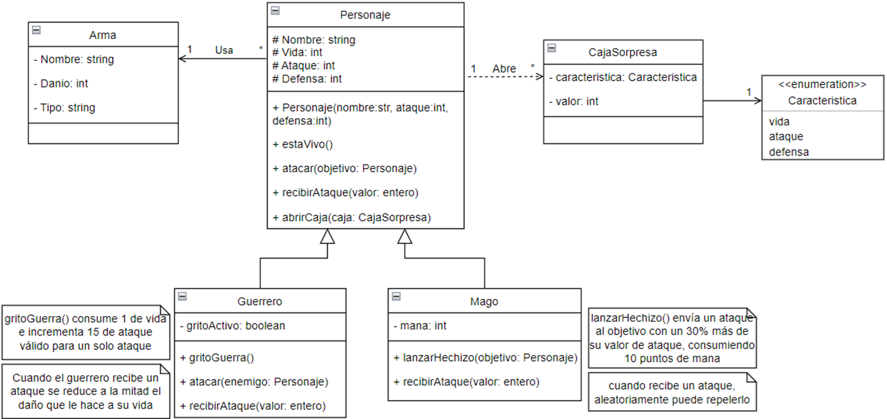

# Clase práctica 20-11

## API de personajes

En esta práctica, trabajaremos con una API de personajes que permite gestionar guerreros y magos. La API está diseñada para realizar operaciones CRUD (Crear, Leer, Actualizar y Eliminar) sobre los personajes.

### Descripción de la API

La API de personajes permite realizar las siguientes operaciones:

1. **Crear un personaje**: Puedes crear un nuevo guerrero o mago proporcionando los atributos necesarios como nombre, ataque, defensa, y otros específicos de cada tipo de personaje.
2. **Obtener todos los personajes**: Recupera una lista de todos los personajes almacenados en el sistema.
3. **Obtener un personaje por nombre**: Recupera los detalles de un personaje específico utilizando su nombre.
4. **Actualizar un personaje**: Modifica los atributos de un personaje existente.
5. **Eliminar un personaje**: Elimina un personaje del sistema utilizando su nombre.

### Modelo de Datos

Los personajes están modelados de la siguiente manera:

### Tarea

Marlín comenzó a desarrollar la API pero no la terminó. Tu tarea es completar lo que falta para ofrecer operaciones CRUD sobre el recurso "Personajes" y corregir los errores que cometió Merlín. Donde corrijas un error, agrega un comentario indicando el error corregido.

### Requisitos

- Revisa el código existente y completa las funciones faltantes.
- Asegúrate de que todas las operaciones CRUD funcionen correctamente.
- Corrige cualquier error que encuentres en la implementación actual y documenta los cambios realizados.

¡Buena suerte y manos a la obra!